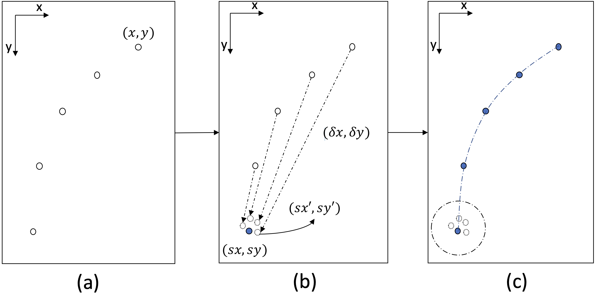
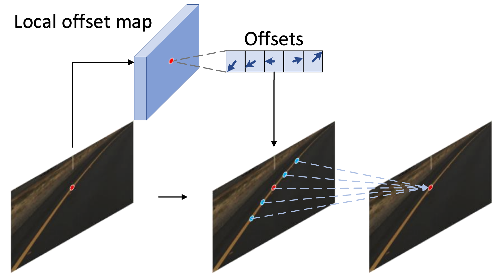

===========
GANet
===========

.. include:: ../tools.rst

Lane detection requires predicting complex topology(拓扑) shapes of lane lines and distinguishing different types of lanes simultaneously.

Due to the slender shapes of lane lines and the need for instance-level discrimination, it is crucial to formulate lane detection task appropriately.
由于车道线很长的形状以及需要区分每个车道线实例, 所以需要选择合适的方案.

Anchor-based
------------

In Figure 1a, Similar to object detection, a group of straight lines with various orientations are defined
as anchors. Points on anchors are regressed to lane lines by predicting the offsets between anchor points and lane
points.
(将线直接定义为 Anchors 我感觉这个很不错)

Afterward, Non-Maximum Suppression (NMS) is applied to select lane lines with the highest confidence.
(有些好奇, 这个NMS怎么实现呢?)

优缺点：车道线实例区分容易, 但是由于预定义 Anchor 问题, 缺少灵活性 
Although this kind of method is efficient in lane discrimination, it is inflexible because of the predefined anchor shapes.
:red:`[` 真的吗, 我不信, 这多灵活啊 :red:`]`

The strong shape prior limits the ability of describing various lane shapes, resulting in sub-optimal performances of
these methods(导致性能不佳).

keypoint estimation and association
------------------------------------

To describe complex shapes of lane lines flexibly, Qu et al. [21] propose to formulate lane detection as a keypoint estimation and association problem, which takes a bottom-up design as illustrated in Figure 1b.

Concretely(具体来说), lanes are represented with a group of ordered key points evenly sampled in a sparse manner.
车道线用一组 :blue:`[` 以稀疏方式均匀采样的有序关键点 :blue:`]` 表示.

Each key point is associated with its neighbours by estimating the spatial offsets between them.
:blue:`(step by step 的形式进行预测, 最终整合成一条线)`

优缺点：灵活但低效和耗时 | 同时错误容易累加
Though keypointbased methods are flexible on the shape of lane lines, 

- it is inefficient and time-consuming to associate only one keypoint to its belonged lane line at each step.
- Besides, the point-by-point extension of keypoints is easy to cause error accumulation due to the lack of global view.

GANet
-----

we formulate the lane detection problem from a new keypoint-based perspective(视角) where each keypoint is directly regressed to its belonged lane. (每个关键点直接回归所属车道)

.. image:: ../images/1.GANet_LFA.png

As illustrated in Figure 1c, each lane line is represented uniquely with its starting point, which is easy to determine without ambiguity.
如图 1c 所示，每条车道线都以其起点唯一地表示，这很容易确定，没有歧义。

:blue:`(那我接下来只需要预测每个KPT到起点的偏移即可, 下一段用了 associate 这个词)`

To associate a keypoint properly, we estimate the offset from the keypoint to its corresponding starting point.

:blue:`(那我接下来只需要预测每条线的起点了对不? )`

:red:`(但原文不是这样做的, 他们的方法暂时无需预测起点)` :
Keypoints :blue:`[` whose approximated starting points fall into the same neighborhood area :blue:`]` will be assigned to the same lane line instance, thus separating keypoints into different groups.
全图每个车道线关键点都能通过其预测的偏移量反推其起点, 起点距离比较近的将被划分为同一条线.

这里总结一下他们的优点：

- Our assignment of keypoints to their belonged lanes is independent of each other and makes the parallel implementation feasible, which greatly improves the efficiency of postprocessing. 
- (每一个KPT分配给他们所属的车道线这个过程是互相独立的, 故可并行实现)

- Besides, the keypoint association is more robust to the accumulated single-point errors since each keypoint owns a global view.
- (此外, 由于每个KPT都拥有全局视图, 因此关键点关联对累积的单点误差更加鲁棒)
- :blue:`[` 低情商: 每个都预测一下起点 :blue:`]`
- :blue:`[` 高情商: 《global view》 :blue:`]`

:red:`step by step 预测 => 找一个通用的基点预测 (缓解单点误差)`

这里再说一下他们遇到的问题和解决方式:

Although keypoints belonging to the same lane line are integrated during post-processing, it is important to ensure the correlations between adjacent points in order to obtain a continuous curve.
虽然属于同一车道线的关键点在后处理过程中被整合，但重要的是要确保相邻点之间的相关性以获得连续曲线。

:green:`可能单独使用以上策略, 获得的曲线不连续, 于是说明了接下来引出来的方法(不知道消融实验有没有)`

To this end, we develop a local information aggregation module named Lane-aware Feature
Aggregator (LFA) to enhance the correlations between adjacent keypoints.
开发局部信息聚合模块(LFA)来加强相邻关键点之间的相关性.

To adapt to the slender and long shapes of lanes, we :red:`[` modify the sampling positions of the standard 2D deformable convolution :blue:`(` by predicting offsets to adjacent points :blue:`)` :red:`]` **to sample within a local area** on the lane each time.

为了适应车道的细长形状，我们通过预测到相邻点的偏移量来修改标准二维可变形卷积[3]的采样位置，以便每次在车道上的局部区域内进行采样。
:red:`(此处需要看代码)`

We further add an auxiliary loss to facilitate estimating the offset predicted on each key point.
我们进一步添加了一个辅助损失，以方便估计在每个关键点上预测的偏移量。

Our LFA module complements(补充) the global association process to enable both local and global views(我们的 LFA 模块补充了全局关联过程，以启用局部和全局视图), which is essential for dense labeling tasks like lane detection.

Contributions
---------------

- GANet
- LFA module (enhance correlations among adjacent keypoints to supplement(补充) local information)
- benchmarks 上获得高效结果

相关工作不想看了
------------------

- Segmentation-based methods
- Detection-based methods
- Keypoint-based methods

Method
------------------

方法概述
^^^^^^^^^^^^^^^^

**Encoder**:

- Given a front-viewed image as input, a CNN backbone together with an FPN [12] neck is adopted to extract multi-level visual representations of the input images. 

- For better feature learning, a self-attention layer is further inserted between the backbone and the neck to :blue:`obtain rich context information`.

**Decoder**:

a keypoint head and an offset head are exploited to generate confidence map and offset map respectively.
(两个头都是 fully convolutional layers)

这里如何获得一个车道线实例呢?

- For each lane instance, we first obtain its starting point as cluster centroid by selecting points with value less than 1 over the offset map. 

- Afterward, keypoints belonging to the same lane are clustered around the sampled starting point with the combination of the confidence map and offset map to construct the complete lane line.

(这俩句说的啥啊..... 来看下我下边的解释)

- 找到 offset map 上值小于 1 的点, 这些点很可能是 starting point, 之后以起始点作为中心进行聚类, 能聚到一起的就是一个车道线实例 :blue:`(` 不知道是这个意思不 :blue:`)`

Method
^^^^^^^^^^^^^^^^

输入图是 :math:`I \in \mathbb{R}^{H \times W \times 3}`

GANet 目标是预测车道线的集合 :math:`L=\{l_1, l_2, ..., l_N\}`, :math:`N` 是车道线数

每条车道线 :math:`l_i` 采样 :math:`K` 个kpt:

.. math::
    l_i = \{ p_i^1, p_i^2, ..., p_i^K \}_{i=1}^K

:math:`p_i^j = (x_i^j, y_i^j)` 为第 :math:`i` 条车道线的第 :math:`j` 个 KPT.

To estimate(评估) all the keypoints, we develop a keypoint head to produce a confidence map :math:`\hat{Y} \in \mathbb{R}^{\frac{H}{r} \times \frac{W}{r}}`, where :math:`r` is the output stride.

The confidence map represents the probability of each location being a keypoint on the lane.

以上是模型方案, 接下来说如何构造置信度 map GT
^^^^^^^^^^^^^^^^^^^^^^^^^^^^^^^^^^^^^^^^^^^^^^^^^^^^^^^^^^^^^^^^

我们在每条车道线采样 :math:`K` 个KPT, 将其 splat 到一个置信度map :math:`Y \in \mathbb{R}^{\frac{H}{r} \times \frac{W}{r}}` 来作为GT.

怎么 splat 呢? 用一个非标准高斯核:

.. math:: 
    Y_{yx} = exp(
        -\frac{
            (x-\tilde{x})^2 + (y-\tilde{y})^2
        }{
            2 \sigma^2
        }
    )

:red:`(此处需要看代码确认)`, :math:`\tilde{x}` 和 :math:`\tilde{y}` 是每个KPT的坐标, :math:`\sigma` 取决于图片的scale.

If there is overlap between two Gaussian maps, we take the element-wise maximum between them.

:blue:`(意思好像是每个sample的KPT有一个高斯map, 然后所有的高斯map叠加, 有重叠取最大而不是求和)`

车道线重建
^^^^^^^^^^^^^^^^

先对置信度 map :math:`\hat{Y}` 做 :math:`1 \times 3` 的 max pooling. 

to select :blue:`[` points of maximum responses within a horizontal local region :blue:`]` as valid keypoints (选择水平局部区域内的最大响应点作为有效关键点) 如上图(a).

首先找 starting point 即可, 找 offset map 上值小于 1 的点, 如果在某个局部区域有多个, 则取其几何中心作为 starting point.

找到起始点, 其余KPT只需要根据 offset :math:`O_{xy}` 进行匹配即可.

Lane-aware Feature Aggregator
^^^^^^^^^^^^^^^^^^^^^^^^^^^^^^^^
2D卷积无法 handle slender(细长) shapes of lane lines

Lane-aware Feature Aggregator (LFA) module 的作用: enhance the local feature representation of
each keypoint. 

We first use a convolution layer to predict the offset between it and its surrounded :math:`M` keypoints on the same lane as follows:

.. math:: 
    \Delta P_i = \phi( \mathcal{F} (p_i) )

- :math:`p_i` 是第 :math:`i` 个 KPT 的坐标值
- :math:`\mathcal{F}(p_i)` 是第 :math:`i` 个KPT的特征表示
- :math:`\Delta P_i = \{ \Delta p_i^m | m=1,...,m \} \in \mathbb{R}^{2M}` 是预测的偏移量

Afterwards, features of adjacent points are integrated with a deformable convolution to aggregate context of the :math:`i`-th keypoint as:

.. math:: 
    \hat{\mathcal{F}} = \sum_{m=1}^M w_m \cdot \mathcal{F}( p_i + \Delta p_i^m )

- :math:`w_m` 是卷积的权重, :math:`m=1,...,M`

接下来引入一个辅助loss来监督偏移量 :math:`\Delta P_i`, 监督 :math:`\Delta P_i` 需要GT, 如何构造呢?

.. math:: 
    \Delta G_i = \{  \Delta g_i^k | k=1,...,K  \}

- :math:`\Delta g_i^k = g_i^k - p_i`
- :math:`g_i^k` 是与第 :math:`i` 个关键点在同一车道线上的第 :math:`k` 个关键点的真实坐标。

匹配
^^^^^^^^^^^^^^^^

:math:`\Delta p_i` 和 :math:`\Delta g_i` 需要建立一个匹配

.. math::
    \hat{\sigma} = \arg \min_\sigma 
    \sum_{m}^M \mathcal{L}_{match} (\Delta p_i^m, \Delta g_i^{\sigma(m)} )

where,

- :math:`\mathcal{L}_{match} = L_2( \Delta p_i^m, \Delta g_i^{\sigma (m)} )`

文章使用匈牙利算法去做匹配, SmoothL1 loss 去监督相邻关键点的预测

.. math:: 
    \mathcal{L}_{aux} = \frac{1}{KNM}
    \sum_{i=1}^{KN}
    \sum_{m=1}^{M}
    SmoothL1(
        \Delta p_i^m, 
        \Delta g_i^{\sigma (m)}
    )

- :math:`K` denotes the number of keypoints on each lane line,
- :math:`N` denotes the number of lane lines  (:red:`x`) 啥意思这是
- :math:`M` denotes the number of sampled adjacent keypoints.

Illustration of the matching between predict points and their ground truth. The red dot is the observed keypoint. The blue dots are the predicted locations of adjacent keypoints. The green dots are the ground-truth locations of adjacent keypoints on the lane line.

损失函数
^^^^^^^^^^^^^^^^

- keypoint regions 与 non-keypoint regions 之间的 focal loss
- address the quantization error, 预测量化误差的loss (原图为了简洁没画) L1 loss 
- offset 的loss L1 loss. (该loss只监督 KPT 而不监督其他点) (xy两个通道) (每个实例上的KPT到起点的偏移)

.. math:: 
    \mathcal{L}_{offset} = \frac
    {1}
    {H' \times W'}
    \sum_{yx}
        | \hat{O}_{yx} - O_{yx}|

- 以及上边监督局部偏移的辅助loss

TuSimple 数据集
^^^^^^^^^^^^^^^^

- 高速公路图片数据集
- 3626张训练图、2782张测试图
- TuSimple 的主要评价指标是准确率:

.. math:: 
    accuracy = \frac
    {\sum_{clip} C_{cilp}}
    {\sum_{clip} S_{cilp}}

- :math:`C_{clip}` is the number of points correctly predicted by the model  
- :math:`S_{clip}`` is the total number of points in the clip(or image)
- A predicted point is considered correct only if it is within 20 pixels to the ground truth point.
- 预测车道线准确率大于 85% 视为真正例

